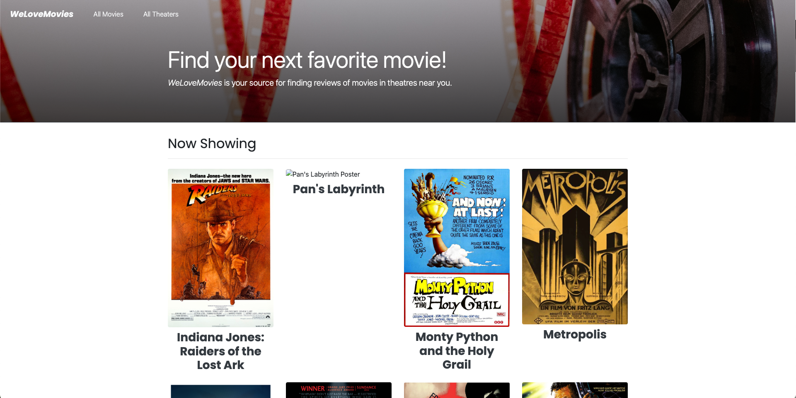
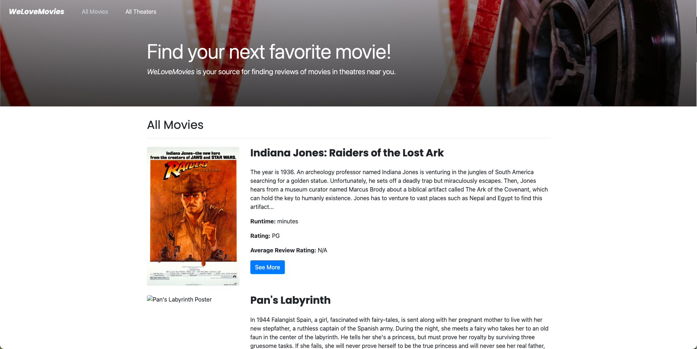
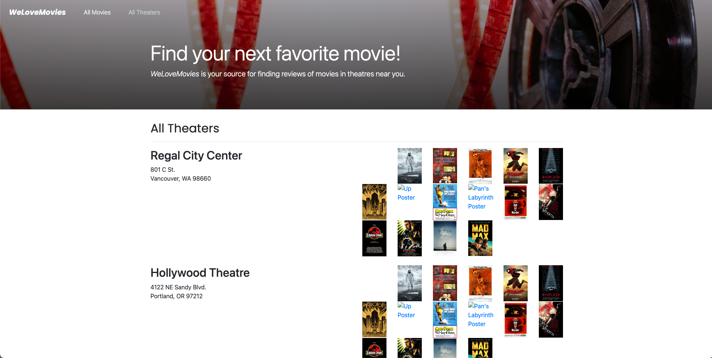
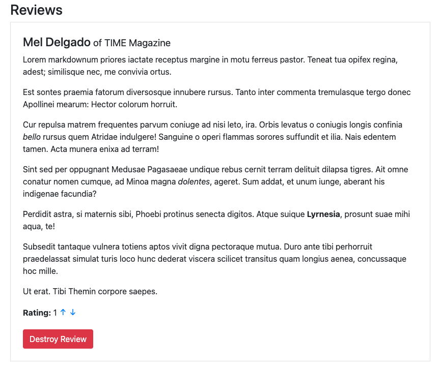

# WeLoveMovies Project

This is the backend to a website designed to show a what movies are playing an which theaters. With these backend files, the user is able to view all movies, which movies are being shown and at what theaters, view reviews for a movie, and update and delete reviews. Below is all the routes available with this code.

| Route                     | Type   | Description                                  |
| ------------------------- | ------ | -------------------------------------------- |
| /movies                   | GET    | List of all movies                           |
| /movies?is_showing=true   | GET    | List all movies currently being shown        |
| /movies/:movieId          | GET    | Movie that matches movieId                   |
| /movies/:movieId/theaters | GET    | List of all theaters playing the movie       |
| /movies/:movieId/reviews  | GET    | Reviews of movie                             |
| /theaters                 | GET    | Gets all theaters and movies playing at each |
| /reviews/:reviewId        | PUT    | updates the given review                     |
| /reviews/:reviewId        | DELETE | deletes given review                         |

This project was built using Node.js, Express, PostgreSQL, Knex

Website Home

List of All Movies `/movies`

List all movies playing at theater `/theaters`

Movie that matches movieId `/movies/:movieId`

Review on `/movies/:movieId` page
